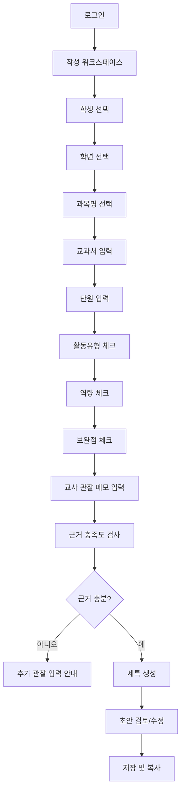
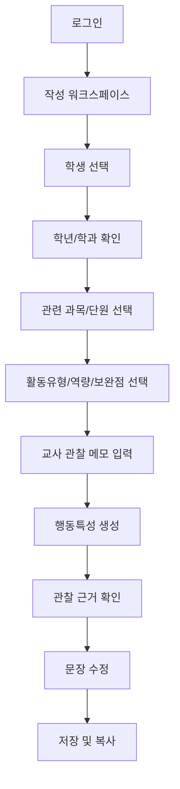
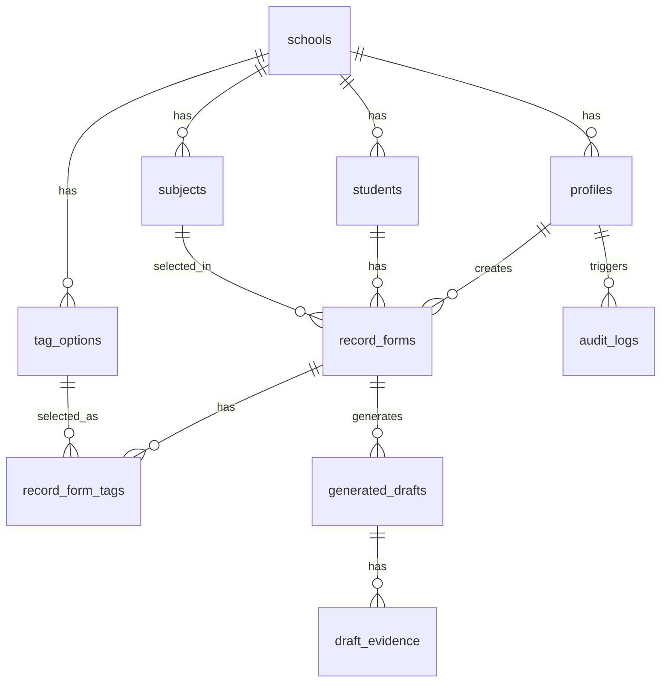

# MVP 설계안: 공업계 고등학교 학생부 작성 지원 SaaS

문서 버전: v1.0  
작성일: 2026-06-18  
기반 PRD: `industrial_high_school_student_record_ai_prd.md`  
기술스택: Next.js, TypeScript, TailwindCSS, OpenAI API, Supabase, PWA

---

## 1. MVP 제품 정의

### 1.1 MVP 한 줄 정의

교사가 학년, 과목, 교과서, 단원, 활동유형, 역량, 보완점, 관찰 메모를 입력하면, 입력 근거 안에서만 세부능력 및 특기사항과 행동특성 및 종합의견 초안을 생성하고 저장하는 웹/PWA 서비스.

### 1.2 MVP 핵심 원칙

- AI는 교사가 입력한 내용 밖의 사실을 만들지 않는다.
- 세특과 행동특성 문장은 같은 입력을 공유하되, 출력 목적과 문체를 분리한다.
- 체크박스는 빠른 구조화 입력을 위한 장치이고, 교사 관찰 메모는 생성 품질의 핵심 근거다.
- 모바일에서는 입력과 생성이 쉬워야 하고, 데스크톱에서는 검토와 편집이 쉬워야 한다.
- MVP는 NEIS 직접 연동 없이 복사/저장 중심으로 제공한다.

### 1.3 MVP 포함 기능

사용자가 요청한 10개 기능:

1. 학년 선택
2. 과목명 선택
3. 교과서 입력
4. 단원 입력
5. 활동유형 체크박스
6. 역량 체크박스
7. 보완점 체크박스
8. 교사 관찰 메모
9. 세특 생성
10. 행동특성 및 종합의견 생성

MVP 운영에 필요한 최소 보조 기능:

- 로그인
- 학교/교사 프로필
- 학과 선택
- 학생 선택
- 생성 결과 저장
- 생성 이력 조회
- 복사하기
- PWA 설치 지원

학생 선택은 요청 목록에는 없지만, 학생부 문장을 학생별로 저장하려면 필수다. 단, MVP 첫 화면에서는 학생 선택을 작게 두고, 작성 입력 흐름을 방해하지 않도록 설계한다.

---

## 2. 사용자 흐름

### 2.1 교과교사 세특 생성 흐름



### 2.2 담임교사 행동특성 생성 흐름



### 2.3 동일 입력의 두 가지 출력

한 번 입력한 관찰 기록에서 두 종류의 초안을 생성한다.

- 세특: 과목, 단원, 실습 활동, 수행 과정, 역량 중심
- 행동특성 및 종합의견: 태도, 협업, 책임감, 보완점, 변화 중심

---

## 3. 화면 설계도

### 3.1 전체 라우트 구조

Next.js App Router 기준:

```text
/login
/app
/app/write
/app/records
/app/students
/app/settings
/api/generate/subject-comment
/api/generate/behavior-comment
/api/records
```

라우트 역할:

- `/login`: 로그인
- `/app`: 대시보드
- `/app/write`: MVP 핵심 작성 화면
- `/app/records`: 생성 이력 및 저장 문장 조회
- `/app/students`: 학생 관리
- `/app/settings`: 선택지, 과목명, 학과 설정
- `/api/generate/subject-comment`: 세특 생성 서버 API
- `/api/generate/behavior-comment`: 행동특성 및 종합의견 생성 서버 API
- `/api/records`: 작성 입력과 생성 결과 저장 API

### 3.2 데스크톱 화면 구조

```text
┌──────────────────────────────────────────────────────────────────────────────┐
│ 상단바: 서비스명 | 작성하기 | 기록조회 | 학생관리 | 설정 | 사용자              │
├──────────────────────────────────────────────────────────────────────────────┤
│                                                                              │
│ ┌──────────────┐ ┌──────────────────────────────┐ ┌───────────────────────┐ │
│ │ 학생/기본정보 │ │ 관찰 입력                    │ │ AI 생성 결과          │ │
│ │              │ │                              │ │                       │ │
│ │ 학년도        │ │ [학년 선택]                  │ │ 탭                    │ │
│ │ 학과          │ │ [과목명 선택]                │ │ [세특] [행동특성]      │ │
│ │ 반            │ │ [교과서 입력]                │ │                       │ │
│ │ 학생          │ │ [단원 입력]                  │ │ 생성 전 상태          │ │
│ │              │ │                              │ │ - 근거 충분/부족      │ │
│ │ 최근 기록     │ │ 활동유형 체크박스            │ │ - 과장 표현 없음      │ │
│ │ - 06/18      │ │ □ 실습 □ 실험 □ 프로젝트     │ │                       │ │
│ │ - 06/12      │ │ □ 발표 □ 보고서 □ 협업       │ │ [세특 생성]           │ │
│ │              │ │                              │ │ [행동특성 생성]       │ │
│ │              │ │ 역량 체크박스                 │ │                       │ │
│ │              │ │ □ 안전관리 □ 도면해석         │ │ 생성 초안             │ │
│ │              │ │ □ 측정/계측 □ 문제해결        │ │ ┌─────────────────┐   │ │
│ │              │ │ □ 협업 □ 품질개선             │ │ │ 생성 문장         │   │ │
│ │              │ │                              │ │ │                 │   │ │
│ │              │ │ 보완점 체크박스               │ │ └─────────────────┘   │ │
│ │              │ │ □ 작업속도 □ 정밀도           │ │                       │ │
│ │              │ │ □ 안전습관 □ 기록정리         │ │ [저장] [복사] [수정]  │ │
│ │              │ │                              │ │                       │ │
│ │              │ │ 교사 관찰 메모                │ │ 근거 표시             │ │
│ │              │ │ ┌────────────────────────┐    │ │ - 선택 태그           │ │
│ │              │ │ │ 실제 관찰 내용을 입력    │    │ │ - 관찰 메모           │ │
│ │              │ │ └────────────────────────┘    │ │                       │ │
│ │              │ │                              │ │                       │ │
│ │              │ │ [임시저장] [입력 초기화]       │ │                       │ │
│ └──────────────┘ └──────────────────────────────┘ └───────────────────────┘ │
│                                                                              │
└──────────────────────────────────────────────────────────────────────────────┘
```

### 3.3 모바일/PWA 화면 구조

모바일에서는 3단계 스텝 화면으로 나눈다.

```text
┌──────────────────────────────┐
│ 작성하기                 저장 │
├──────────────────────────────┤
│ Step 1. 기본정보              │
│                              │
│ 학생 선택                    │
│ [검색 또는 번호 선택]         │
│                              │
│ 학년 선택                    │
│ [1학년 v]                    │
│                              │
│ 과목명 선택                  │
│ [기계 기초 v]                │
│                              │
│ 교과서                       │
│ [교과서명 입력]              │
│                              │
│ 단원                         │
│ [단원명 입력]                │
│                              │
│              [다음]          │
└──────────────────────────────┘
```

```text
┌──────────────────────────────┐
│ 작성하기                 저장 │
├──────────────────────────────┤
│ Step 2. 관찰 태그             │
│                              │
│ 활동유형                     │
│ [실습] [실험] [프로젝트]      │
│ [발표] [보고서] [협업]        │
│                              │
│ 역량                         │
│ [안전관리] [측정/계측]        │
│ [도면해석] [문제해결]         │
│ [협업] [품질개선]             │
│                              │
│ 보완점                       │
│ [작업속도] [정밀도]           │
│ [안전습관] [기록정리]         │
│                              │
│       [이전]        [다음]    │
└──────────────────────────────┘
```

```text
┌──────────────────────────────┐
│ 작성하기                 저장 │
├──────────────────────────────┤
│ Step 3. 메모와 생성           │
│                              │
│ 교사 관찰 메모                │
│ ┌──────────────────────────┐ │
│ │ 실제 관찰 사실 입력       │ │
│ │ 예: PLC 입력 주소를...    │ │
│ └──────────────────────────┘ │
│                              │
│ 근거 상태                    │
│ 관찰 메모 42자 / 권장 40자 이상│
│                              │
│ [세특 생성]                  │
│ [행동특성 생성]              │
│                              │
│ 생성 결과                    │
│ ┌──────────────────────────┐ │
│ │ 초안 표시                 │ │
│ └──────────────────────────┘ │
│                              │
│ [복사] [저장]                │
└──────────────────────────────┘
```

### 3.4 화면별 컴포넌트

#### 작성 화면 `/app/write`

주요 컴포넌트:

- `StudentSelector`
- `GradeSelect`
- `SubjectSelect`
- `TextbookInput`
- `UnitInput`
- `ActivityTypeCheckboxGroup`
- `CompetencyCheckboxGroup`
- `ImprovementCheckboxGroup`
- `ObservationMemoTextarea`
- `EvidenceStatusPanel`
- `GenerateSubjectButton`
- `GenerateBehaviorButton`
- `GeneratedDraftPanel`
- `EvidenceSummary`
- `SaveRecordButton`
- `CopyButton`

#### 기록 조회 화면 `/app/records`

주요 컴포넌트:

- `RecordFilterBar`
- `RecordTable`
- `DraftPreviewDrawer`
- `CopyDraftButton`
- `VersionHistory`

#### 설정 화면 `/app/settings`

주요 컴포넌트:

- `SubjectOptionManager`
- `TagOptionManager`
- `DepartmentTemplateManager`
- `PromptPolicyManager`

MVP에서는 설정 화면을 최소화하고, 기본 선택지는 시드 데이터로 제공한다.

---

## 4. 입력 항목 설계

### 4.1 학년 선택

UI:

- Select 또는 Segmented Control
- 값: 1, 2, 3

DB:

- `record_forms.grade`

검증:

- 필수

### 4.2 과목명 선택

UI:

- Select
- 기본 과목 예시:
  - 재료일반
  - 금속재료
  - 기계기초공작
  - 기계제도
  - 자동화설비
  - 공압유압제어
  - PLC제어
  - 전기회로
  - 전자회로
  - 전기전자제어

DB:

- `subjects`
- `record_forms.subject_id`

검증:

- 필수
- 직접 입력 옵션 허용

### 4.3 교과서 입력

UI:

- Text Input

DB:

- `record_forms.textbook_title`

검증:

- 선택 입력
- 학교/교사별 자주 쓰는 교과서명 자동완성은 v1.1

### 4.4 단원 입력

UI:

- Text Input
- 예: `PLC 기본 명령어`, `금속 열처리`, `직류 회로 측정`

DB:

- `record_forms.unit_title`

검증:

- 필수 권장
- 단원이 없으면 AI 생성 시 구체성이 떨어진다는 안내 표시

### 4.5 활동유형 체크박스

기본 옵션:

- 실습
- 실험
- 프로젝트
- 발표
- 보고서
- 조별활동
- 문제해결활동
- 장비점검
- 산출물 제작
- 데이터 분석

DB:

- `tag_options.category = 'activity_type'`
- `record_form_tags`

### 4.6 역량 체크박스

기본 옵션:

- 안전관리
- 작업절차 이해
- 도면/회로도 해석
- 측정/계측
- 장비 조작
- 공정 이해
- 문제 원인 분석
- 품질 개선
- 협업
- 작업일지 작성
- 피드백 반영
- 자기주도성

학과별 추가 옵션:

- 재료기술과: 금속조직 관찰, 경도 측정, 용접 결함 확인, 전극 공정 이해
- 자동화기계과: PLC 입출력 이해, 공압 회로 구성, 센서 위치 조정, 설비 보전
- 전기전자제어과: 회로 구성, 신호 계측, 납땜 품질, 모터 제어, 시퀀스 회로 이해

DB:

- `tag_options.category = 'competency'`
- `record_form_tags`

### 4.7 보완점 체크박스

기본 옵션:

- 작업 속도
- 정밀도
- 안전습관
- 기록 정리
- 장비 사용 숙련도
- 용어 이해
- 결과 해석
- 협업 의사소통
- 실습 전 준비
- 마무리 정리

출력 원칙:

- 보완점은 부정적 낙인 표현으로 쓰지 않는다.
- "부족함"보다 "보완이 필요함", "지도 후 개선됨", "다시 확인하려는 태도를 보임" 중심으로 변환한다.

DB:

- `tag_options.category = 'improvement'`
- `record_form_tags`

### 4.8 교사 관찰 메모

UI:

- Textarea
- 권장 길이: 40자 이상
- Placeholder:

```text
학생이 실제로 한 행동, 실습 과정, 피드백 후 변화, 안전수칙 준수 여부를 사실 중심으로 입력하세요.
예: PLC 입력 주소를 잘못 지정해 센서가 동작하지 않자 배선 상태와 주소를 다시 확인하고 프로그램을 수정함.
```

DB:

- `record_forms.observation_memo`

검증:

- 10자 미만이면 생성 제한
- "성실함", "잘함"만 있는 경우 추가 관찰 요청
- 개인정보/민감정보 의심 단어 경고

---

## 5. AI 생성 설계

### 5.1 생성 버튼 동작

#### 세특 생성

입력:

- 학년
- 과목명
- 교과서
- 단원
- 활동유형
- 역량
- 보완점
- 교사 관찰 메모
- 학과

출력:

- 학생부 세특 문체 초안
- 사용 근거 요약
- 경고 목록

#### 행동특성 및 종합의견 생성

입력:

- 위와 동일

출력:

- 행동특성 및 종합의견 문체 초안
- 사용 근거 요약
- 경고 목록

차이:

- 세특은 과목 수행과 실습 역량 중심
- 행동특성은 태도, 협업, 책임감, 개선 태도 중심

### 5.2 생성 전 검증

세특 생성 가능 조건:

- 학생 선택 완료
- 학년 선택 완료
- 과목명 선택 완료
- 단원 입력 권장
- 활동유형 1개 이상
- 역량 1개 이상
- 교사 관찰 메모 10자 이상

행동특성 생성 가능 조건:

- 학생 선택 완료
- 관찰 메모 10자 이상
- 역량 또는 보완점 1개 이상
- 활동유형 1개 이상 권장

생성 제한:

- 관찰 메모가 추상어만 포함된 경우
  - 예: "성실함", "태도가 좋음", "열심히 함"
- 개인정보/민감정보가 포함된 경우
- 수상, 자격증, 외부활동이 근거 없이 포함된 경우

### 5.3 서버 API 구조

```text
POST /api/generate/subject-comment
POST /api/generate/behavior-comment
```

요청 예시:

```json
{
  "recordFormId": "uuid",
  "studentId": "uuid",
  "department": "automation_machine",
  "grade": 2,
  "subjectName": "PLC제어",
  "textbookTitle": "자동화 설비 실습",
  "unitTitle": "PLC 기본 명령어와 센서 입력",
  "activityTypes": ["실습", "문제해결활동"],
  "competencies": ["PLC 입출력 이해", "문제 원인 분석", "안전관리"],
  "improvements": ["기록 정리"],
  "observationMemo": "PLC 입력 주소를 잘못 지정해 센서가 동작하지 않자 배선 상태와 주소를 다시 확인하고 프로그램을 수정함."
}
```

응답 예시:

```json
{
  "draftId": "uuid",
  "type": "subject_comment",
  "text": "PLC 기본 명령어 실습에서 센서 입력 주소와 배선 상태를 확인하며 자동화 설비의 동작 조건을 이해함. 센서가 정상적으로 동작하지 않는 상황에서 입력 주소를 다시 점검하고 프로그램을 수정하여 문제 원인을 해결하려는 모습을 보임.",
  "evidence": [
    "과목: PLC제어",
    "단원: PLC 기본 명령어와 센서 입력",
    "활동유형: 실습, 문제해결활동",
    "역량: PLC 입출력 이해, 문제 원인 분석, 안전관리",
    "관찰 메모: PLC 입력 주소를 잘못 지정해..."
  ],
  "warnings": []
}
```

### 5.4 OpenAI 프롬프트 정책

시스템 메시지 핵심:

```text
당신은 대한민국 공업계 고등학교 교사의 학생부 작성 보조자다.
입력된 관찰 근거 안에서만 작성한다.
없는 사실, 수상, 자격증, 외부활동, 성격 단정, 미래 예측을 생성하지 않는다.
과장 표현을 피하고 실제 관찰 중심으로 학생부 문체를 사용한다.
근거가 부족하면 문장을 생성하지 말고 추가 관찰이 필요하다고 답한다.
```

세특 생성 지시:

```text
세부능력 및 특기사항 문체로 작성하라.
과목, 단원, 활동유형, 역량, 관찰 메모를 반영하라.
실습 과정, 장비/공정/측정/제어/안전/문제해결 중 입력된 근거만 사용하라.
1~2문장, 250자 이내로 작성하라.
```

행동특성 생성 지시:

```text
행동특성 및 종합의견 문체로 작성하라.
관찰 가능한 태도, 협업, 책임감, 피드백 수용, 보완 노력 중심으로 작성하라.
교과 성취를 과장하지 말고 생활 태도와 성장 과정으로 표현하라.
1~2문장, 250자 이내로 작성하라.
```

### 5.5 생성 후 검사

서버에서 후처리:

- 금지어 검사
- 과장 표현 검사
- 입력 근거에 없는 고유명사 검사
- 민감정보 검사
- 길이 검사

금지 표현 예시:

- 최고
- 압도적
- 탁월한 재능
- 반드시 성공
- 타 학생보다
- 항상 완벽
- 게으름
- 산만함
- 불성실함

---

## 6. 데이터 구조

### 6.1 ERD



### 6.2 테이블 목록

MVP 필수:

- `schools`
- `profiles`
- `students`
- `subjects`
- `tag_options`
- `record_forms`
- `record_form_tags`
- `generated_drafts`
- `draft_evidence`
- `audit_logs`

MVP 이후:

- `classes`
- `textbooks`
- `units`
- `prompt_templates`
- `export_jobs`
- `attachments`

### 6.3 SQL 스키마 초안

```sql
create table schools (
  id uuid primary key default gen_random_uuid(),
  name text not null,
  region text,
  created_at timestamptz not null default now()
);

create table profiles (
  id uuid primary key references auth.users(id) on delete cascade,
  school_id uuid not null references schools(id) on delete cascade,
  name text not null,
  role text not null check (role in ('teacher', 'homeroom_teacher', 'admin')),
  department text check (department in ('materials', 'automation_machine', 'electrical_electronic_control')),
  created_at timestamptz not null default now(),
  updated_at timestamptz not null default now()
);

create table students (
  id uuid primary key default gen_random_uuid(),
  school_id uuid not null references schools(id) on delete cascade,
  grade int not null check (grade in (1, 2, 3)),
  department text not null check (department in ('materials', 'automation_machine', 'electrical_electronic_control')),
  class_name text,
  student_no int,
  name text not null,
  status text not null default 'active' check (status in ('active', 'inactive')),
  created_at timestamptz not null default now(),
  updated_at timestamptz not null default now()
);

create table subjects (
  id uuid primary key default gen_random_uuid(),
  school_id uuid not null references schools(id) on delete cascade,
  department text check (department in ('materials', 'automation_machine', 'electrical_electronic_control')),
  name text not null,
  is_default boolean not null default false,
  created_by uuid references profiles(id),
  created_at timestamptz not null default now()
);

create table tag_options (
  id uuid primary key default gen_random_uuid(),
  school_id uuid references schools(id) on delete cascade,
  department text check (department in ('materials', 'automation_machine', 'electrical_electronic_control')),
  category text not null check (category in ('activity_type', 'competency', 'improvement')),
  label text not null,
  description text,
  is_default boolean not null default false,
  sort_order int not null default 0,
  created_at timestamptz not null default now()
);

create table record_forms (
  id uuid primary key default gen_random_uuid(),
  school_id uuid not null references schools(id) on delete cascade,
  teacher_id uuid not null references profiles(id),
  student_id uuid not null references students(id) on delete cascade,
  grade int not null check (grade in (1, 2, 3)),
  department text not null check (department in ('materials', 'automation_machine', 'electrical_electronic_control')),
  subject_id uuid references subjects(id),
  subject_name text not null,
  textbook_title text,
  unit_title text,
  observation_memo text not null,
  evidence_status text not null default 'draft' check (evidence_status in ('draft', 'insufficient', 'sufficient')),
  created_at timestamptz not null default now(),
  updated_at timestamptz not null default now()
);

create table record_form_tags (
  id uuid primary key default gen_random_uuid(),
  record_form_id uuid not null references record_forms(id) on delete cascade,
  tag_option_id uuid references tag_options(id),
  category text not null check (category in ('activity_type', 'competency', 'improvement')),
  label text not null,
  created_at timestamptz not null default now()
);

create table generated_drafts (
  id uuid primary key default gen_random_uuid(),
  record_form_id uuid not null references record_forms(id) on delete cascade,
  school_id uuid not null references schools(id) on delete cascade,
  student_id uuid not null references students(id) on delete cascade,
  teacher_id uuid not null references profiles(id),
  type text not null check (type in ('subject_comment', 'behavior_comment')),
  status text not null default 'draft' check (status in ('draft', 'edited', 'approved')),
  draft_text text not null,
  edited_text text,
  warnings jsonb not null default '[]'::jsonb,
  model text,
  prompt_version text not null default 'v1',
  created_at timestamptz not null default now(),
  updated_at timestamptz not null default now()
);

create table draft_evidence (
  id uuid primary key default gen_random_uuid(),
  draft_id uuid not null references generated_drafts(id) on delete cascade,
  evidence_type text not null,
  evidence_text text not null,
  created_at timestamptz not null default now()
);

create table audit_logs (
  id uuid primary key default gen_random_uuid(),
  school_id uuid not null references schools(id) on delete cascade,
  actor_id uuid references profiles(id),
  action text not null,
  target_table text,
  target_id uuid,
  metadata jsonb not null default '{}'::jsonb,
  created_at timestamptz not null default now()
);
```

### 6.4 인덱스

```sql
create index idx_students_school_grade_department
  on students (school_id, grade, department);

create index idx_record_forms_student_created
  on record_forms (student_id, created_at desc);

create index idx_record_forms_teacher_created
  on record_forms (teacher_id, created_at desc);

create index idx_generated_drafts_record_type
  on generated_drafts (record_form_id, type);

create index idx_tag_options_school_category
  on tag_options (school_id, category);
```

### 6.5 RLS 정책 방향

MVP 기본 정책:

- 사용자는 자신의 `school_id` 데이터만 접근 가능
- 교사는 자신이 작성한 `record_forms`와 `generated_drafts`를 읽고 수정 가능
- 담임교사와 관리자의 확장 권한은 v1.1에서 정교화

예시:

```sql
alter table record_forms enable row level security;

create policy "teachers can manage own record forms"
on record_forms
for all
using (teacher_id = auth.uid())
with check (teacher_id = auth.uid());
```

실제 구현에서는 `profiles.school_id`를 조인하는 정책 함수가 필요하다.

---

## 7. 시드 데이터

### 7.1 활동유형 기본값

```text
실습
실험
프로젝트
발표
보고서
조별활동
문제해결활동
장비점검
산출물 제작
데이터 분석
```

### 7.2 공통 역량 기본값

```text
안전관리
작업절차 이해
도면/회로도 해석
측정/계측
장비 조작
공정 이해
문제 원인 분석
품질 개선
협업
작업일지 작성
피드백 반영
자기주도성
```

### 7.3 보완점 기본값

```text
작업 속도
정밀도
안전습관
기록 정리
장비 사용 숙련도
용어 이해
결과 해석
협업 의사소통
실습 전 준비
마무리 정리
```

### 7.4 학과별 역량 추가값

재료기술과:

```text
금속조직 관찰
경도 측정
용접 결함 확인
열처리 조건 이해
전극 공정 이해
충방전 데이터 해석
```

자동화기계과:

```text
PLC 입출력 이해
공압 회로 구성
센서 위치 조정
설비 동작 순서 이해
기계 요소 조립
설비 보전
```

전기전자제어과:

```text
회로 구성
신호 계측
납땜 품질
시퀀스 회로 이해
마이크로컨트롤러 입출력 제어
모터 제어
```

---

## 8. Next.js 구현 구조

### 8.1 폴더 구조

```text
app/
  (auth)/
    login/
      page.tsx
  app/
    layout.tsx
    page.tsx
    write/
      page.tsx
    records/
      page.tsx
    students/
      page.tsx
    settings/
      page.tsx
  api/
    generate/
      subject-comment/
        route.ts
      behavior-comment/
        route.ts
    records/
      route.ts
components/
  write/
    StudentSelector.tsx
    GradeSelect.tsx
    SubjectSelect.tsx
    TextbookInput.tsx
    UnitInput.tsx
    CheckboxGroup.tsx
    ObservationMemoTextarea.tsx
    EvidenceStatusPanel.tsx
    GeneratedDraftPanel.tsx
  layout/
    AppShell.tsx
    MobileBottomNav.tsx
lib/
  supabase/
    client.ts
    server.ts
  openai/
    generateComment.ts
    prompts.ts
    guardrails.ts
  validators/
    recordFormSchema.ts
types/
  database.ts
  records.ts
```

### 8.2 상태 관리

MVP 권장:

- 서버 상태: Supabase + React Server Components
- 폼 상태: React Hook Form
- 검증: Zod
- 클라이언트 캐시: TanStack Query는 v1.1에서 검토 가능

폼 데이터 타입:

```ts
type RecordFormInput = {
  studentId: string;
  grade: 1 | 2 | 3;
  department: 'materials' | 'automation_machine' | 'electrical_electronic_control';
  subjectId?: string;
  subjectName: string;
  textbookTitle?: string;
  unitTitle?: string;
  activityTypes: string[];
  competencies: string[];
  improvements: string[];
  observationMemo: string;
};
```

### 8.3 TailwindCSS 디자인 방향

스타일:

- 업무용 SaaS답게 차분하고 정보 밀도 높은 UI
- 큰 히어로 영역 없이 바로 작성 화면 진입
- 카드 남발보다 좌/중/우 작업 패널 구조
- 모바일은 스텝 기반 단일 열

주요 색상:

- 배경: `slate-50`
- 본문: `slate-900`
- 보조 텍스트: `slate-500`
- 주요 액션: `emerald-600` 또는 `blue-600`
- 경고: `amber-600`
- 위험: `rose-600`

---

## 9. PWA 설계

### 9.1 MVP PWA 범위

- 앱 설치 가능
- 홈 화면 아이콘
- 기본 manifest
- 작성 중 폼 localStorage 임시 저장
- 네트워크 끊김 안내

### 9.2 MVP 제외

- 완전 오프라인 생성
- 오프라인 Supabase 동기화
- 첨부 파일 오프라인 큐

### 9.3 임시 저장 정책

- 브라우저 localStorage 또는 IndexedDB에 작성 중 폼만 저장
- 학생명과 관찰 메모가 포함되므로 저장 전 안내 필요
- 저장 성공 후 로컬 임시 데이터 삭제
- 공용 PC 사용 가능성을 고려해 자동 로그아웃과 임시 저장 삭제 버튼 제공

---

## 10. 보안 설계

### 10.1 OpenAI API 보안

- OpenAI API Key는 서버 환경변수에만 저장
- 클라이언트에서 직접 OpenAI 호출 금지
- `/api/generate/*` route handler에서만 호출
- 요청 전 Supabase Auth 세션 검증
- 생성 요청과 응답을 `generated_drafts`, `audit_logs`에 기록

### 10.2 개인정보 최소화

- AI 요청에는 학생명 대신 "학생"으로 전달
- 학년, 학과, 과목, 단원, 태그, 관찰 메모만 전달
- 불필요한 학생 번호, 반, 이름은 모델에 전달하지 않음

### 10.3 입력 필터

민감정보 의심 키워드:

- 가족
- 병원
- 질병
- 장애
- 종교
- 경제
- 주소
- 전화번호
- 주민등록번호

처리:

- 저장 자체를 막기보다 교사에게 경고
- AI 생성에는 해당 구절 제외 권장

---

## 11. MVP 개발 순서

### Sprint 1: 프로젝트 기반

- Next.js + TypeScript + TailwindCSS 세팅
- Supabase Auth 연결
- 기본 레이아웃
- PWA manifest
- DB 마이그레이션

### Sprint 2: 입력 폼

- 학생 선택
- 학년 선택
- 과목명 선택
- 교과서 입력
- 단원 입력
- 체크박스 그룹
- 관찰 메모
- 임시 저장

### Sprint 3: 저장과 조회

- `record_forms` 저장
- `record_form_tags` 저장
- 작성 기록 조회
- 학생별 기록 조회

### Sprint 4: AI 생성

- OpenAI API 연동
- 세특 생성
- 행동특성 생성
- 근거 부족 검사
- 금지 표현 검사
- 생성 결과 저장

### Sprint 5: 검토와 배포

- 생성 결과 편집
- 저장/복사
- 모바일 QA
- PWA 설치 QA
- RLS 정책 점검
- 파일럿 배포

---

## 12. MVP 완료 기준

기능 완료:

- 교사가 로그인할 수 있다.
- 학생을 선택할 수 있다.
- 학년, 과목명, 교과서, 단원을 입력할 수 있다.
- 활동유형, 역량, 보완점을 체크할 수 있다.
- 교사 관찰 메모를 입력할 수 있다.
- 세특 초안을 생성할 수 있다.
- 행동특성 및 종합의견 초안을 생성할 수 있다.
- 생성 결과를 저장하고 복사할 수 있다.
- 작성 기록을 다시 조회할 수 있다.

품질 완료:

- 관찰 메모가 부족하면 생성이 제한된다.
- AI 출력에 없는 사실이 추가되지 않는다.
- 모바일 화면에서 작성이 가능하다.
- PWA 설치가 가능하다.
- OpenAI API Key가 클라이언트에 노출되지 않는다.
- Supabase RLS가 기본 적용된다.

---

## 13. 화면별 MVP 우선순위

### P0

- `/login`
- `/app/write`
- `/app/records`

### P1

- `/app/students`
- `/app/settings`

### P2

- 반 전체 작성 현황
- 엑셀 내보내기
- 교사 간 관찰 공유
- 학급 단위 행동특성 관리

---

## 14. 개발자가 바로 구현할 최소 객체

### 14.1 Create Record Form

```ts
type CreateRecordFormPayload = {
  studentId: string;
  grade: 1 | 2 | 3;
  department: 'materials' | 'automation_machine' | 'electrical_electronic_control';
  subjectId?: string;
  subjectName: string;
  textbookTitle?: string;
  unitTitle?: string;
  activityTypes: string[];
  competencies: string[];
  improvements: string[];
  observationMemo: string;
};
```

### 14.2 Generated Draft

```ts
type GeneratedDraft = {
  id: string;
  recordFormId: string;
  type: 'subject_comment' | 'behavior_comment';
  draftText: string;
  editedText?: string;
  evidence: string[];
  warnings: string[];
  status: 'draft' | 'edited' | 'approved';
  createdAt: string;
};
```

### 14.3 Tag Option

```ts
type TagOption = {
  id: string;
  category: 'activity_type' | 'competency' | 'improvement';
  department?: 'materials' | 'automation_machine' | 'electrical_electronic_control';
  label: string;
  description?: string;
  sortOrder: number;
};
```

---

## 15. 결론

이 MVP는 "교사 입력 -> 근거 구조화 -> 세특/행동특성 생성 -> 저장/복사"에 집중한다. 초기에는 학생부 전체 관리 플랫폼보다, 실습 교사가 학기말에 가장 부담을 느끼는 문장 생성 흐름을 완성하는 것이 중요하다. 데이터 구조는 향후 학급 단위 관리, 교사 간 관찰 공유, 엑셀 내보내기, NEIS 복사 최적화로 확장 가능하도록 설계한다.

