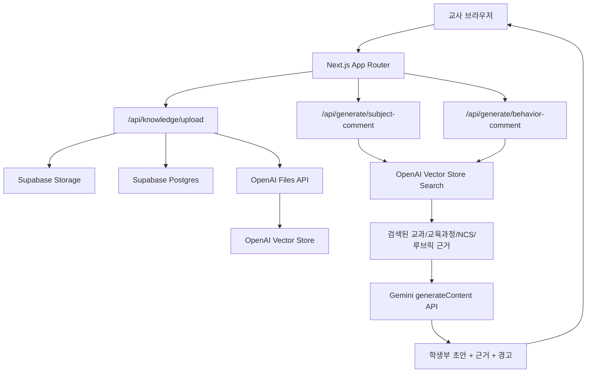
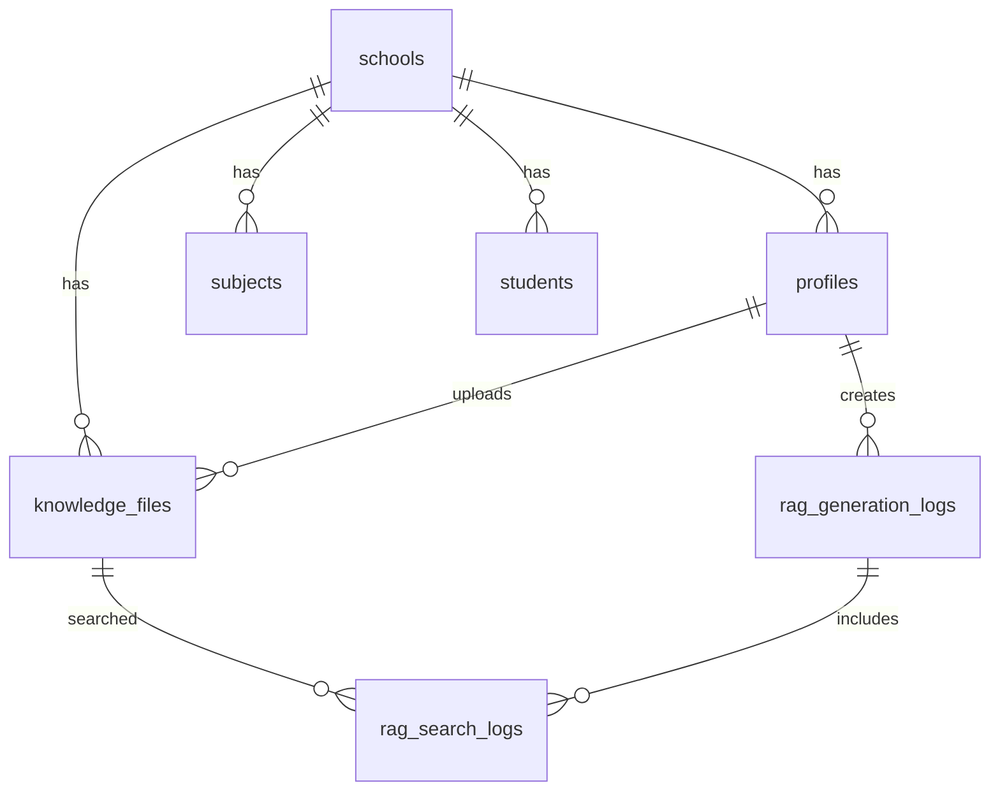

# RAG 기반 학생부 작성 보조 아키텍처 설계

작성일: 2026-06-18  
대상 앱: 공업계 마이스터고 학생부 작성 보조 웹앱  
배포 조합: Vercel + Supabase + OpenAI API  
구현 기준: Next.js App Router, TypeScript, TailwindCSS, OpenAI Vector Store Search/File Search, Gemini generateContent

---

## 1. 전체 아키텍처



### 역할 분리

- Vercel
  - Next.js 앱 호스팅
  - 서버 API Route 실행
  - OpenAI API Key, Supabase Secret Key를 서버 환경변수로 보관

- Supabase
  - 교사, 학생, 과목, 업로드 파일 메타데이터 저장
  - 원본 파일을 Storage bucket에 보관
  - 생성 로그와 검색 근거 로그 저장
  - RLS로 학교/교사 단위 접근 제어

- OpenAI
  - Files API로 업로드 파일 수신
  - Vector Store에 파일 연결 및 인덱싱
  - Vector Store Search로 관련 문서 chunk 검색

- Google Gemini
  - `GEMINI_API_KEY`를 사용하는 서버 API Route에서 학생부 초안 생성

---

## 2. DB 테이블 구조

### 2.1 핵심 테이블



### 2.2 `knowledge_files`

교사가 업로드한 교과서 학습목표, 학과별 교육과정, NCS 능력단위, 평가 루브릭 파일의 메타데이터를 저장한다.

주요 컬럼:

- `id`
- `school_id`
- `uploaded_by`
- `original_filename`
- `storage_bucket`
- `storage_path`
- `mime_type`
- `file_size`
- `document_type`
- `grade`
- `department`
- `subject_name`
- `unit_title`
- `openai_file_id`
- `openai_vector_store_id`
- `vector_status`
- `created_at`

### 2.3 `rag_generation_logs`

세특/행특 생성 요청과 결과를 저장한다.

주요 컬럼:

- `id`
- `school_id`
- `teacher_id`
- `student_id`
- `mode`: `subject` 또는 `behavior`
- `input_payload`
- `draft_text`
- `warnings`
- `model`
- `created_at`

### 2.4 `rag_search_logs`

생성 시 어떤 문서 chunk가 검색되어 근거로 사용되었는지 저장한다.

주요 컬럼:

- `id`
- `generation_log_id`
- `knowledge_file_id`
- `openai_file_id`
- `filename`
- `score`
- `content_excerpt`
- `attributes`
- `created_at`

---

## 3. 파일 업로드 흐름

1. 교사가 지식베이스 화면에서 파일을 선택한다.
2. 파일 형식을 검사한다.
   - 허용: PDF, DOCX, TXT, CSV
   - 확장자와 MIME type 모두 검사
3. 교사가 메타데이터를 입력한다.
   - 과목
   - 학년
   - 학과
   - 단원
   - 문서 유형
4. Next.js `/api/knowledge/upload`로 `multipart/form-data` 전송
5. 서버 API Route가 Supabase Secret Key로 Supabase Storage에 원본 파일 저장
6. 서버 API Route가 OpenAI Files API에 같은 파일 업로드
7. OpenAI Vector Store가 없으면 생성하거나, 환경변수 `OPENAI_VECTOR_STORE_ID`를 사용
8. OpenAI Vector Store에 파일을 연결한다.
9. Vector Store file attributes에 태그를 저장한다.
   - `school_id`
   - `grade`
   - `department`
   - `subject_name`
   - `unit_title`
   - `document_type`
10. Supabase `knowledge_files`에 메타데이터와 OpenAI ID를 저장한다.
11. 클라이언트에 업로드 결과와 인덱싱 상태를 반환한다.

---

## 4. RAG 생성 흐름

1. 교사가 세특 또는 행특 작성 화면에서 입력값을 작성한다.
2. 서버 API Route가 입력값을 검증한다.
3. 검색 query를 구성한다.
   - 과목명
   - 교과서
   - 단원
   - 활동 유형
   - 역량
   - 보완점
   - 교사 관찰 메모
4. OpenAI Vector Store Search API를 호출한다.
5. 검색 filter를 적용한다.
   - `school_id = 현재 학교`
   - `department = 선택 학과`
   - `grade = 선택 학년`
6. 관련 chunk가 없으면 생성하지 않고 "관련 문서 근거 부족"을 반환한다.
7. 검색된 chunk를 근거 컨텍스트로 정리한다.
8. Gemini `models.generateContent` API에 다음 제약을 함께 전달한다.
   - 교과/교육과정/NCS/루브릭 근거는 검색 문서에서만 사용
   - 학생의 실제 활동은 교사 관찰 메모에서만 사용
   - 허위 활동, 없는 성취, 수상, 자격증, 외부활동 생성 금지
   - 과장 표현 금지
9. 생성 결과에 금지 표현 후처리 검사를 수행한다.
10. 초안, 검색 근거, 경고를 클라이언트로 반환한다.

---

## 5. 보안 원칙

- `OPENAI_API_KEY`는 클라이언트 번들에 포함하지 않는다.
- `SUPABASE_SECRET_KEY` 또는 legacy `SUPABASE_SERVICE_ROLE_KEY`는 서버 API Route에서만 사용한다.
- 클라이언트에는 Supabase publishable key만 노출한다.
- 파일 업로드 API는 서버에서 파일 타입과 크기를 검증한다.
- 업로드 원본 파일과 검색 로그에는 학교/교사 권한을 적용한다.
- 생성 프롬프트에는 학생명 대신 "학생"으로 전달한다.

---

## 6. Vercel 환경변수

필수:

```text
OPENAI_API_KEY=
OPENAI_MODEL=gpt-5.5
OPENAI_VECTOR_STORE_ID=
GEMINI_API_KEY=
GEMINI_MODEL=gemini-3.5-flash
NEXT_PUBLIC_SUPABASE_URL=
NEXT_PUBLIC_SUPABASE_PUBLISHABLE_KEY=
SUPABASE_SECRET_KEY=
SUPABASE_STORAGE_BUCKET=knowledge-files
DEFAULT_SCHOOL_ID=demo-school
```

호환:

```text
NEXT_PUBLIC_SUPABASE_ANON_KEY=
SUPABASE_SERVICE_ROLE_KEY=
```

---

## 7. 허위 생성 방지 정책

- 관련 문서 검색 결과가 없으면 생성하지 않는다.
- 문서에 없는 학습목표, NCS 능력단위, 평가 기준을 만들지 않는다.
- 교사 관찰 메모에 없는 학생 활동, 성취, 태도를 만들지 않는다.
- "최고", "압도적", "탁월한 재능", "반드시 성공", "타 학생보다", "항상 완벽" 등 과장 표현을 후처리에서 경고한다.
- 출력에는 사용 근거를 함께 표시한다.

---

## 8. 참고 공식 문서

- OpenAI File Search guide: https://developers.openai.com/api/docs/guides/tools-file-search
- OpenAI Vector Store Search API: https://developers.openai.com/api/reference/resources/vector_stores/methods/search
- Gemini GenerateContent API: https://ai.google.dev/api/generate-content
- Supabase Storage standard uploads: https://supabase.com/docs/guides/storage/uploads/standard-uploads
- Supabase Next.js server-side client: https://supabase.com/docs/guides/auth/server-side/nextjs
- Supabase Row Level Security: https://supabase.com/docs/guides/database/postgres/row-level-security
